# Graffiti Style Skills

> Codex 向けの、実在する支持体に描かれる6つのオリジナル・グラフィティシステムです。単語、配色、支持体、天候、摩耗、フレーミングは変更できますが、各スタイルの構成ロジックは維持してください。

[English](README.md) | [简体中文](README.zh-CN.md) | 日本語

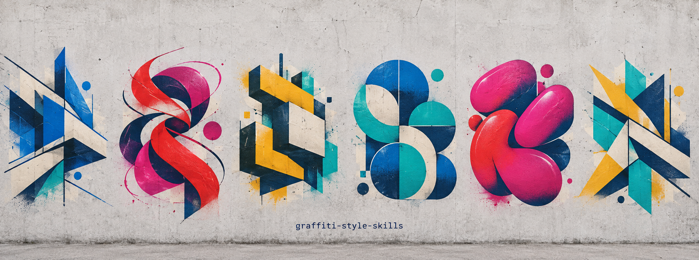

[スタイルを見る](#スタイル) · [インストール](docs/install.ja.md) · [skill を使う](#skill-を使う) · [スタイルの作成手順](#スタイルの作成手順) · [公開配布の境界](#公開配布の境界) · [ライセンス](#ライセンス)

## このリポジトリについて

これは独立したグラフィティ生成 skill のテキスト中心ライブラリです。各 skill は、実在する支持体上で素材としては平坦なオリジナルのスプレー作品を作るための、固有の視覚文法を定義します。フォント集、アーティスト模倣パック、再利用可能なタグ集ではありません。

各スタイルには固有の境界があります。単語は変えられますが、ribbon-flow システムを angular architecture に崩してはいけません。soft-cell freight band を offset-shadow システムに変えることもできません。必要な構成文法に最も特化した skill を選んでください。

## スタイル

### 01 — Angular Architectural Wildstyle

[この skill を開く](skills/001-angular-architectural-wildstyle/README.md)

機械的・建築的な描画の奥行きを備えた、相互接続する角張ったレタリング。支持体は単一で連続した、素材として平坦な表面のままです。

**変更可能：** 単語またはマーク、配色、支持体、天候、摩耗、照明、トリミング。
**固定：** 角張った骨格、共有ジオメトリ、局所的な重なり順、刃のような終端、保護されたネガティブスペース、平面スプレーによる奥行きの錯覚。

<p>
  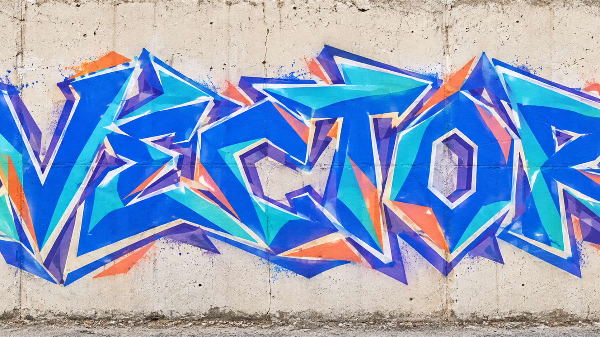
  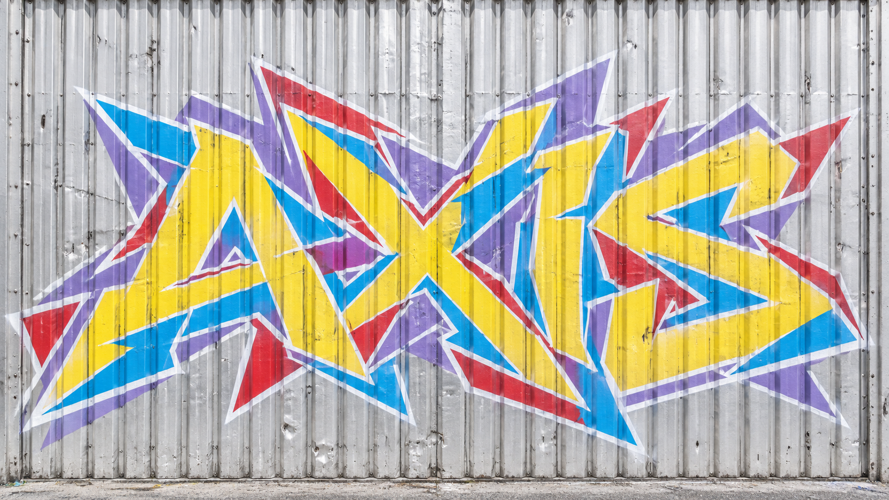
</p>

### 02 — Balanced Ribbon-Flow Wildstyle

[この skill を開く](skills/002-balanced-ribbon-flow-wildstyle/README.md)

太いバーと柔軟なリボンが交互に組織する幅広いワードグループ。実在する支持体上に、編み込まれたような描画の奥行きを作ります。

**変更可能：** 単語、配色の役割、支持体、雰囲気、フレーミング、補助的なアクセント。
**固定：** 幅広い水平バランス、バーとリボンの交互配置、制御された交差、第一の組織原理としてのフロー。

<p>
  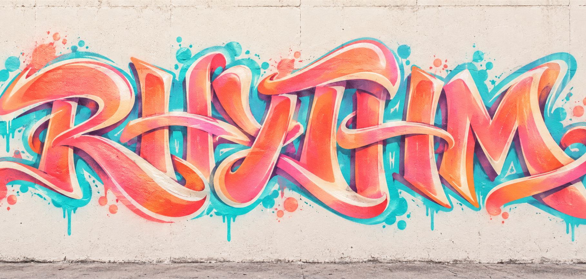
  
</p>

### 03 — Offset Block-Shadow Wildstyle

[この skill を開く](skills/003-offset-block-shadow-wildstyle/README.md)

明瞭なモジュラー文字と統合されたずれた背面レイヤーにより、物理的な厚みなしで空間的なずれを作ります。

**変更可能：** 単語、配色、支持体、ずれの方向、トリミング、照明、摩耗。
**固定：** 一貫したモジュラー前景、大きな描画済み背面レイヤー、制御されたオフセット関係、平面的なスプレー表現。

<p>
  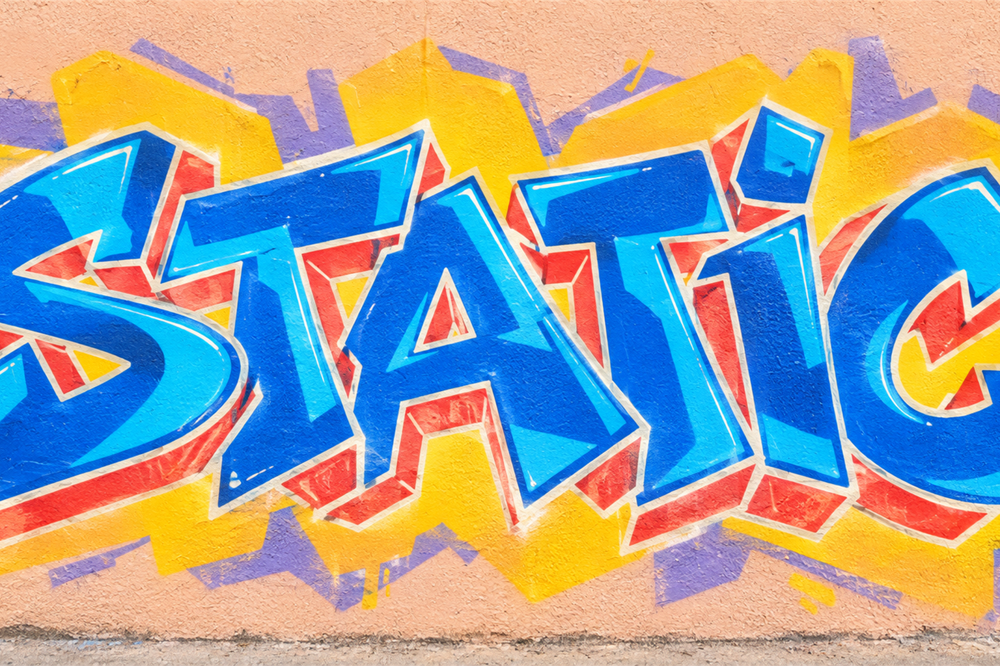
  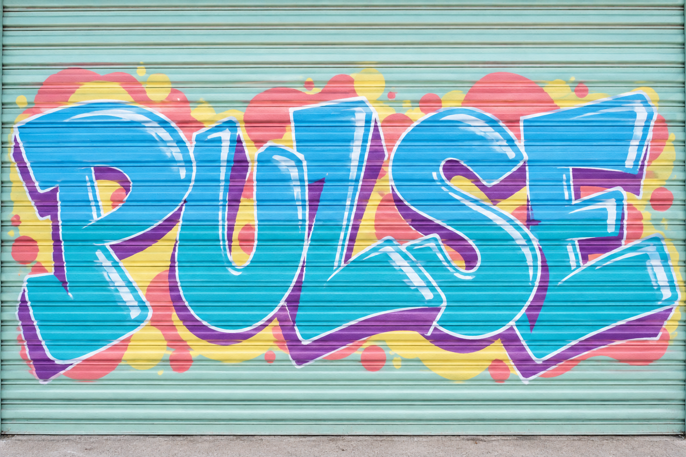
</p>

### 04 — Modular Geometric Letter Mural

[この skill を開く](skills/004-modular-geometric-letter-mural/README.md)

丸みのあるモジュール、選択的な階調遷移、細い文字間ラインで構成される、幅広くほぼ正面のワードフィールドです。

**変更可能：** 単語、コンパクトな配色の役割、支持体、階調の焦点、風化、フレーミング。
**固定：** 矩形の描画フィールド、重なる丸みのあるジオメトリ、選択的な暗い足場、内部の隙間関係として使う細線。

<p>
  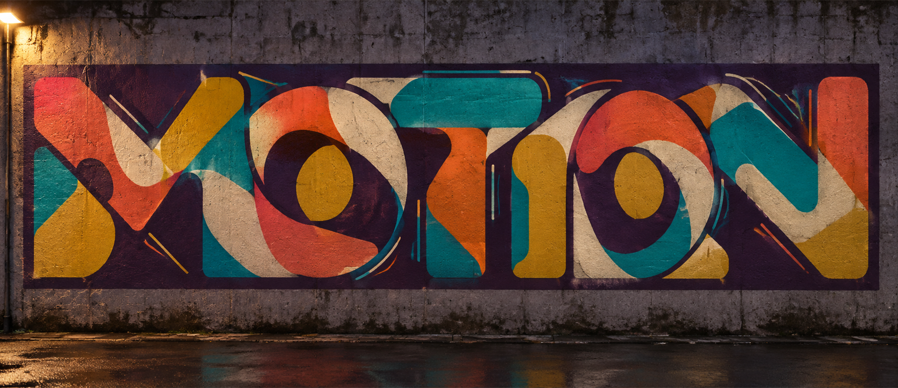
  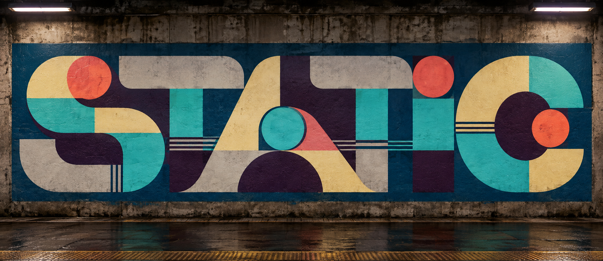
</p>

### 05 — Soft-Cell Freight Funk

[この skill を開く](skills/005-soft-cell-freight-funk/README.md)

実在する支持体に描く、積み重なった膨らんだセル、広い内部通路、暗い曲がり、疎なグループアクセントで作る、浅く接続されたワードバンドです。貨車は有効な支持体の一例であり、必須ではありません。

**変更可能：** 単語、支持体、支持体の詳細、配色の役割、セルの比率、通路の経路、トリミング、天候。
**固定：** かみ合う上下のセルバンク、収められた広い通路、局所的な暗い曲がり、連続したほぼ正面の実在する支持体。

<p>
  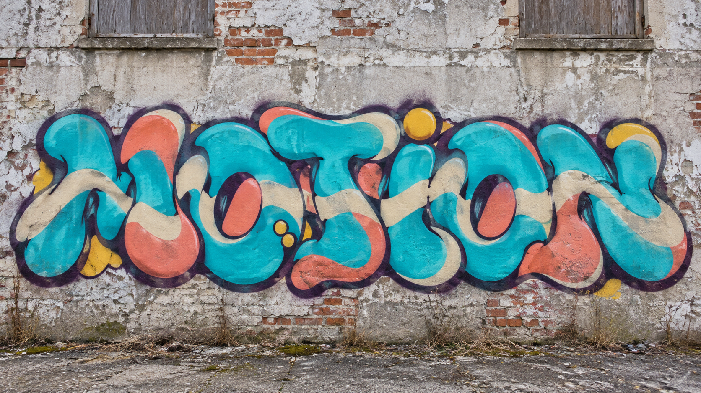
  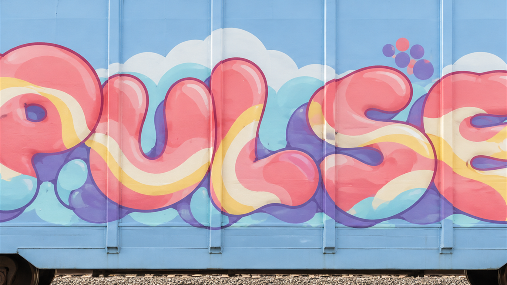
</p>

### 06 — Planar Interlock Lettering

[この skill を開く](skills/006-planar-interlock-lettering/README.md)

部分的に読める字形の塊を、幅広く硬いエッジの描画面が中断します。短い暗色の切り返しが、選択された交差を明確にします。

**変更可能：** 単語、支持体、配色、壁の摩耗、曲線と角度のバランス、マーク、トリミング、照明。
**固定：** 緩い水平フィールド、分散した読解アンカー、幅広い局所的な平面インターロック、1 枚の連続した壁への視覚的に平坦なスプレー塗装。壁自体は風化、テクスチャ、物理的な凹凸があっても構いません。

<p>
  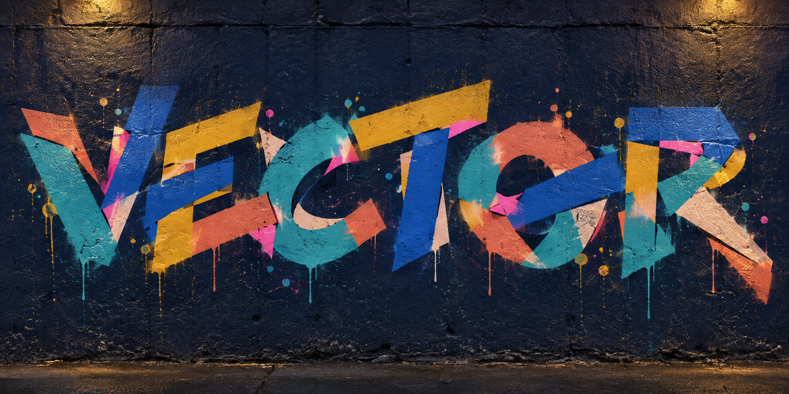
  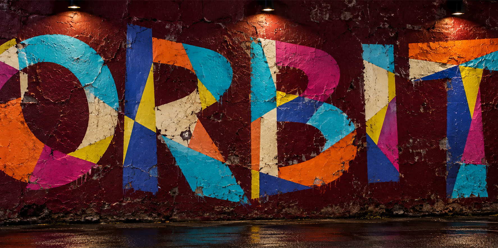
</p>

## skill を使う

このリポジトリを Codex で開くか、任意のディレクトリを Codex skills ディレクトリの下へコピーしてください。次に skill を名前で呼び出し、単語またはマークを渡します。主体を指定しない場合、各 skill は `Graffiti` を使います。

```text
Use $planar-interlock-lettering.

Create the word "MOTION" as a near-frontal aerosol mural on a worn concrete wall.
Use a muted, role-based palette and overcast daylight. Keep the painted faces flat;
make the word readable through distributed partial anchors rather than a typed sequence.
```

公開 skill パッケージには説明、Codex メタデータ、prompt、例が含まれます。生成前に選んだ `SKILL.md` を読み、肯定的な構成ルールと除外条件を保ってください。

## スタイルの作成手順

```text
提供された参照資料と権利の境界
                ↓
Reference Coherence & Core-Set Gate
                ↓
Visual DNA と構成分析
                ↓
スタイル仕様、skill、prompt、例
                ↓
独立した画像生成ゲートと視覚レビュー
                ↓
構造検証、registry 更新、公開リリース
```

視覚システムは検証前に固定します。反復される関係、階層、支持体の振る舞い、字形構成、接続、重なり順、除外条件です。prompt の細部を変えても自動的に新スタイルにはなりません。レンダリングまたは評価の振る舞いを変えうる変更には再検証が必要です。

## 公開配布の境界

公開パッケージは、配布しやすく安全なように意図的に簡潔です。ユーザー向け skill 契約、Codex メタデータ、prompt、例、ローカル README のみを含みます。

非公開の参照画像、生成された評価画像、intake レポート、Visual DNA の草稿、検証用作業資料はバージョン管理の外に置かれます。README の12枚の選定サンプルは、このリポジトリのオリジナル生成イラストです。公開 skill 契約を示すものであり、歴史的証拠、人間が描いた作品、アーティストの著作性を表すものではありません。

## 新しいスタイルを追加する

新しいスタイルは `work/<id>/` で開始してください。他のスタイルの Visual DNA や結論を引き継いではいけません。参照境界、coherence gate、スタイル契約、独立した検証、視覚レビュー、リポジトリチェックが完了した後にのみ `skills/<id>/` へ移動して公開できます。同じ変更内で、並び替え済み registry に追加してください。

これにより、ライブラリはモジュラーに保たれます。ひとつのスタイル、ひとつの構成言語、近接スタイルとの明確な境界です。

## ライセンス

Copyright 2026 poplarytics。[Apache License 2.0](LICENSE) の下で配布されます。
